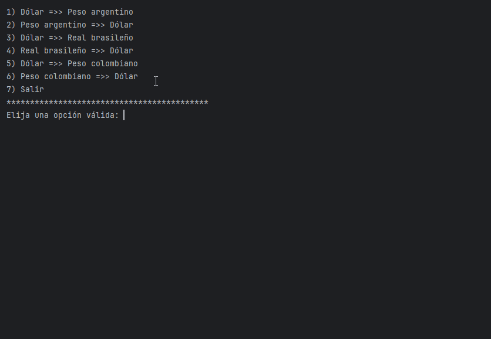

# 💸 Conversor de Monedas - API ExchangeRate


---

## 🧭 Índice

* [Título e imagen de portada](#-conversor-de-monedas---api-exchangerate)
* [Insignias](#insignias)
* [Índice](#-índice)
* [Descripción del proyecto](#-descripción-del-proyecto)
* [Estado del proyecto](#-estado-del-proyecto)
* [Características de la aplicación y demostración](#-características-de-la-aplicación-y-demostración)
* [Acceso al proyecto](#-acceso-al-proyecto)
* [Tecnologías utilizadas](#-tecnologías-utilizadas)
* [Personas Contribuyentes](#-personas-contribuyentes)
* [Personas-Desarrolladores del Proyecto](#-personas-desarrolladores-del-proyecto)
* [Licencia](#-licencia)
* [Conclusión](#-conclusión)

---

## 🧾 Descripción del proyecto

Aplicación de consola escrita en Java que convierte divisas usando datos reales obtenidos desde la API ExchangeRate. Simple, directa y con enfoque en el aprendizaje y la conexión con servicios REST.

---

## 🚦 Estado del proyecto

- 🚧 En desarrollo — versión funcional básica completa  
- ✅ Sin advertencias ni errores de ejecución  
- 🆗 Lista para extender a más monedas o interfaz gráfica (GUI)

---

## ✨ Características de la aplicación y demostración

- Conexión HTTP a la API de tipo REST.
- Deserialización automática del JSON usando Gson.
- Menú interactivo para el usuario.
- Conversión en ambas direcciones entre USD, ARS, BRL y COP.
- Manejo de errores de red y validación básica.
- Limpieza de advertencias en tiempo de compilación.

### 🎥 Demostración en consola

https://github.com/Alejandrotoro027/Conversor_de_moneda/assets/ConversorMoneda.gif

<details>
<summary>Ver demostración en video</summary>



</details>

## 🧭 Acceso al Proyecto

Para acceder al proyecto, seguí estos pasos:

1. Cloná el repositorio:
   ```bash
   git clone https://github.com/tu-usuario/tu-repo.git

Abrilo en tu IDE favorito y ejecutá la clase Main.

## 🚀 Tecnologías Utilizadas

El proyecto fue desarrollado utilizando las siguientes tecnologías:

- ⚙️ **Java 17** – Lenguaje de programación principal
- 🔧 **Gson** – Librería para parsear respuestas JSON
- 🌐 **HTTPURLConnection** – Para realizar solicitudes GET a APIs REST
- 💻 **IntelliJ IDEA** – Entorno de desarrollo utilizado (recomendado)
- 🌍 **ExchangeRate API** – API externa que provee tasas de cambio en tiempo real
- 📦 **Maven o Gradle** (opcional) – Para gestión de dependencias si lo integrás como proyecto completo

> Estas herramientas permiten construir una aplicación robusta y escalable, ideal como base para aplicaciones de conversión o consulta de datos financieros.

## 👨‍💻 Personas Desarrolladoras del Proyecto

| Nombre               | Rol                  | Contacto                          |
|----------------------|----------------------|-----------------------------------|
| Alejandro            | Desarrollador Fullstack | [LinkedIn](https://www.linkedin.com/in/diego-alejandro-guerrero-toro-a98371188/) · [GitHub](https://github.com/Alejandrotoro027/) |

> Si querés colaborar, podés abrir un Pull Request o contactarme por cualquiera de los medios disponibles.

## 🧩 Conclusión

Este proyecto demuestra cómo consumir y procesar datos desde una API externa utilizando Java, manejando JSON con la biblioteca Gson y mostrando los resultados de forma clara al usuario por consola.  
Es una herramienta simple pero poderosa que puede evolucionar hacia una app de escritorio o web.  
Además, sirve como práctica real para el manejo de peticiones HTTP, procesamiento de datos y buenas prácticas en desarrollo de software.  
¡Seguiremos mejorando y escalando el proyecto! 🚀💡
